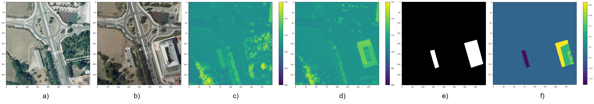

# 3DCD: Inferring 3D change detection from bitemporal optical images

<div align="center">
  
</div>

**3DCD** project has the goal of automatically inferring *2D and 3D change detection (elevation change)* maps of human artefacts from bitemporal optical images, *without the need of relying on DSMs*.

The project is carried out by Virginia Coletta, [Valerio Marsocci](https://sites.google.com/uniroma1.it/valeriomarsocci) and Dr. Roberta Ravanelli, under the supervision of professors Simone Scardapane and Mattia Crespi. 

For more information click on the site **[3DCD](https://sites.google.com/uniroma1.it/3dchangedetection/home-page)** or frame the QR code.
<div align="center">
  
</div>

## Contents
1. [Features](#features)
2. [Dataset](#dataset)
3. [Installation](#installation)
4. [Usage](#usage)
5. [Results](#results)
6. [Related resources](#relatedresources)
7. [Citation](#citation)
8. [License](#license)

## Features

Change detection is one of the most active research areas in Remote Sensing (RS). Most of the recently developed change detection methods are based on deep learning (DL) algorithms. This kind of algorithms is generally focused on generating two-dimensional (2D) change maps, thus only identifying planimetric changes in land use/land cover (LULC) and not considering nor returning any information on the corresponding *elevation changes*. 

Our work goes one step further, proposing two novel networks, able to solve simultaneously the 2D and 3D CD tasks, and the **3DCD dataset**, a novel and freely available dataset precisely designed for this multitask. Particularly, the aim of this work is to lay the foundations for the development of DL algorithms able to automatically infer an elevation (3D) CD map - together with a standard 2D CD map, starting only from a pair of bitemporal optical images. 

The proposed architecture consists of a transformer-based network, the MultiTask Bitemporal Images Transformer (MTBIT). Particularly, MTBIT is a transformer-based architecture, that makes use of a semantic tokenizer. 
This model is, thus, able to *obtain 3D CD maps from two optical images taken at different time instants, without the need to rely directly on elevation data during the inference step*. Another model capable to solve this problem effectively is SUNet, a modified version of FC-Siam-conc.


## Dataset

At this [link](https://drive.google.com/drive/folders/1XRmUeIevRfZT982verCI4kq_8CRR4ueq?usp=sharing), the dataset is available.
<div align="center"></div>

Main features of the data contained in the proposed dataset in the table below. 

|       **Image**       | **Number of pixels** | **GSD** |
|:---------------------:|:--------------------:|:-------:|
| Orthophotos from 2010 |        400x400       |  0.50 m |
| Orthophotos from 2017 |        400x400       |  0.50 m |
|     DSMs from 2010    |        200x200       |  1.0 m  |
|     DSMs from 2017    |        200x200       |  1.0 m  |
|       2D CD maps      |        400x400       |  0.50 m |
|       3D CD maps      |        200x200       |  1.0 m  |

To use your costume dataset, please respect this structure (and remember to rename the subfolder "2010" and "2017" in the dataloader):

```bash
Custom dataset
├─train
   ├─t1
   ├─t2
   ├─2dcd
   └─3dcd
├─val
   ├─t1
   ├─t2
   ├─2dcd
   └─3dcd
└─test
   ├─t1
   ├─t2
   ├─2dcd
   └─3dcd
```


## Installation

- Download [Python 3](https://www.python.org/)
- Install the packages:
```bash
pip install -r requirements.txt
```

## Usage 

To train the model, prepare a *.yaml* file and put in the ```config``` directory (where you can find an example) and then run the following command:
```bash
python train.py --config="your_config_file"
```

## Results
In this section we briefly show the results obtained. First, we compared our models with other models available in the literature. 

|    Architecture  |   F1 (%)  |   IoU (%) | RMSE (m) | cRMSE (m) |
|:----------------:|:---------:|:---------:|:--------:|:---------:|
|   ChangeFormer   |   42.89   |   27.30   |   1.31   |    7.09   |
|       FC-EF      |   46.32   |   30.14   |   1.41   |    7.04   |
|   FC-Siam-conc   |   38.30   |   23.69   |   1.42   |   10.66   |
|       SUNet      |   59.72   |   42.57   |   1.24   |    6.47   |
|     ResNet18     |    7.87   |    4.82   |   1.56   |    7.45   |
|     IM2HEIGHT    |     -     |     -     |   1.57   |    7.59   |
| **MTBIT (ours)** | **62.15** | **45.09** | **1.20** |  **6.46** |

<div align="center"></div>

<div align="center"></div>

Next, we show how the results vary when the 2D loss (α) and 3D loss (β) weights are changed.

| Architecture | α | β | F1 (%) |  IoU (%) | RMSE (m) | cRMSE (m) |
|:------------:|:-:|:-:|:------:|:--------:|:--------:|:---------:|
|     MTBIT    | 0 | 1 |  5.76  |   2.98   |   1.24   |    6.93   |
|     MTBIT    | 1 | 0 |  19.40 |   10.74  |   5.37   |   80.02   |
|     MTBIT    | 1 | 1 |  62.03 |   44.96  |   1.22   |    6.75   |
|     MTBIT    | 1 | 3 |  62.15 |   45.09  |   1.20   |    6.46   |
|     MTBIT    | 3 | 1 |  62.77 |   45.74  |   1.21   |    6.80   |
|     MTBIT    | 1 | 5 |  62.71 |   45.68  |   1.19   |    6.53   |
|     MTBIT    | 5 | 1 |  63.65 |   46.68  |   1.24   |    6.83   |

## Related resources

In this section, we point out some useful repositories, resources and connected projects. 

<!-- - [BIT Github repository](https://github.com/justchenhao/BIT_CD) -->
- [Organismo Autonomo Centro Nacional de Informacion Geografica](http://centrodedescargas.cnig.es/CentroDescargas/buscadorCatalogo.do?codFamilia=LIDAR#)

Reach us out if you would like to be inserted in this list.

## Citation
If you found our work useful, consider citing these works:

-[Inferring 3D change detection from bitemporal optical images](https://arxiv.org/abs/2205.15903)
```bash
@misc{https://doi.org/10.48550/arxiv.2205.15903,
  doi = {10.48550/ARXIV.2205.15903},
  url = {https://arxiv.org/abs/2205.15903},
  author = {Marsocci, Valerio and Coletta, Virginia and Ravanelli, Roberta and Scardapane, Simone and Crespi, Mattia},
  title = {Inferring 3D change detection from bitemporal optical images},
  publisher = {arXiv},
  year = {2022},
  copyright = {Creative Commons Attribution 4.0 International}
}
```

-[3DCD: a new dataset for 2D and 3D change detection using deep learning techniques](https://www.int-arch-photogramm-remote-sens-spatial-inf-sci.net/XLIII-B3-2022/1349/2022/)
```bash
@Article{isprs-archives-XLIII-B3-2022-1349-2022,
AUTHOR = {Coletta, V. and Marsocci, V. and Ravanelli, R.},
TITLE = {3DCD: A NEW DATASET FOR 2D AND 3D CHANGE DETECTION USING DEEP LEARNING TECHNIQUES},
JOURNAL = {The International Archives of the Photogrammetry, Remote Sensing and Spatial Information Sciences},
VOLUME = {XLIII-B3-2022},
YEAR = {2022},
PAGES = {1349--1354},
URL = {https://www.int-arch-photogramm-remote-sens-spatial-inf-sci.net/XLIII-B3-2022/1349/2022/},
DOI = {10.5194/isprs-archives-XLIII-B3-2022-1349-2022}
}
```

## License

Code is released for non-commercial and research purposes only. For commercial purposes, please contact the authors.
